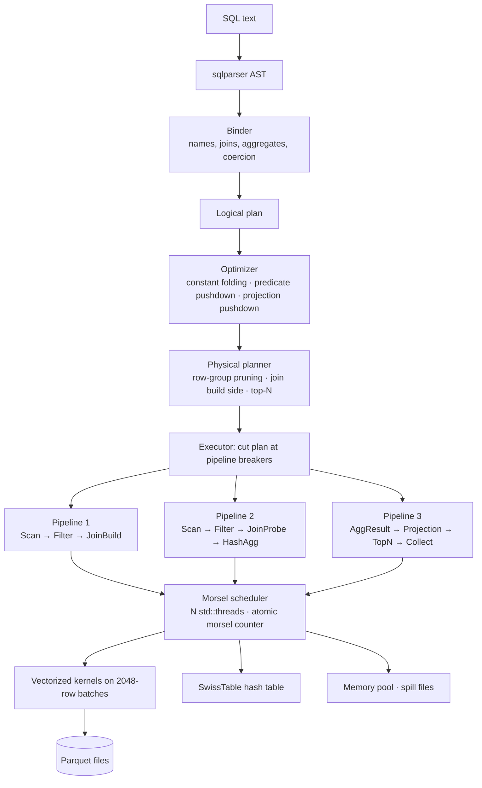

# MiniLake

**MiniLake is a vectorized, multi-threaded, columnar SQL query engine written in Rust.**
It runs analytical SQL (a TPC-H subset) directly over Parquet files. Queries flow through its own
building blocks:

- **Columnar batch format** with validity bitmaps, dictionary-encoded strings and selection vectors.
- **Vectorized expression evaluator** built from type-specialized kernels that LLVM auto-vectorizes.
- **Push-based pipelines**, the execution model DuckDB and HyPer use.
- **SwissTable-style hash table** written from scratch, used by hash aggregation and hash joins.
- **Morsel-driven scheduler** on plain `std::thread` with a lock-free work queue.
- **Memory pool** with per-operator budgets and spill-to-disk aggregation.
- **Rule-based optimizer** with predicate/projection pushdown and Parquet row-group pruning.
- **Scatter-gather distributed mode** over TCP.

`sqlparser` is used only to parse SQL and `parquet` only to decode pages. Everything after parsing
is MiniLake's own code: plans, kernels, operators, hash tables, scheduling and memory management.
There is no DataFusion, no Arrow compute, no rayon and no `unsafe`.

```
$ minilake query --file queries/tpch/q1.sql --data data/sf1 --threads 8
```

---

## Architecture



| Crate | What it contains |
|---|---|
| `minilake-core` | `Column`, `Batch`, `Bitmap`, `SelectionVector`, `ScalarValue`, dates, batch IPC format |
| `minilake-hashtable` | SwissTable-style hash index, chaining baseline, hash functions |
| `minilake-storage` | Parquet → columns (no Arrow), table catalog, row-group statistics and pruning |
| `minilake-exec` | expression evaluator, kernels, operators, pipelines, scheduler, memory pool |
| `minilake-sql` | binder, logical plan, optimizer rules, physical planner, `Session` |
| `minilake-dist` | coordinator / worker scatter-gather over TCP |
| `minilake-cli` | `minilake` binary: `query`, `bench`, `repl`, `worker`, `coordinator` |

### Life of TPC-H Q3

```
TopN(10) [revenue DESC, o_orderdate]                      <- pipeline 4 (single thread, ordered)
  Projection
    HashAggregate group_by=[l_orderkey, o_orderdate, o_shippriority]   <- breaker (pipeline 3 sink)
      HashJoin l_orderkey = o_orderkey         build = (customer ⋈ orders)
        HashJoin o_custkey = c_custkey         build = customer   <- pipeline 1: Scan(customer) → JoinBuild
          Scan customer  filter c_mktsegment = 'BUILDING'
          Scan orders    filter o_orderdate < 1995-03-15        <- pipeline 2: Scan → Probe → JoinBuild
        Scan lineitem    filter l_shipdate > 1995-03-15  row_groups=k/n   <- pipeline 3: Scan → Probe → HashAgg
```

`EXPLAIN` prints the logical, optimized and physical plans. `EXPLAIN ANALYZE` adds, per operator:
rows in/out, batches, CPU time, peak reserved memory, row groups read, and wall time per pipeline.

---

## Quickstart

```bash
# 1. data (needs Python + DuckDB; see scripts/gen_tpch.py for the tpchgen-cli alternative)
pip install -r scripts/requirements.txt
python scripts/gen_tpch.py --sf 1 --out data            # data/sf1/<table>/part-*.parquet

# 2. build
cargo build --release

# 3. run
./target/release/minilake query --file queries/tpch/q1.sql --data data/sf1 --threads 8
./target/release/minilake query "EXPLAIN ANALYZE $(cat queries/tpch/q3.sql)" --data data/sf1
./target/release/minilake query --file queries/tpch/q5.sql --data data/sf1 --memory-limit 64MB
./target/release/minilake query --file queries/tpch/q1.sql --data data/sf1 \
      --memory-limit 16MB --spill-dir /tmp/minilake-spill
./target/release/minilake repl --data data/sf1

# 4. correctness vs DuckDB
python scripts/diff_test.py --data data/sf1 --binary target/release/minilake --threads 8

# 5. distributed demo (3 local worker processes)
python scripts/run_distributed.py --data data/sf1 --workers 3 --threads 4
```

CI-style checks: `./scripts/check.sh` (or `scripts/check.ps1`) runs `cargo fmt --check`,
`cargo clippy -D warnings` and `cargo test`.

### Supported SQL

`SELECT` / `WHERE` / `GROUP BY` / `HAVING` / `ORDER BY` (ASC/DESC, NULLS FIRST/LAST, aliases,
positions) / `LIMIT` / `OFFSET`. Inner equi-joins, both as `JOIN ... ON` and as comma joins with
equality predicates. `COUNT(*)`, `COUNT`, `SUM`, `AVG`, `MIN`, `MAX`. Arithmetic, comparisons,
`AND`/`OR`/`NOT` with three-valued logic, `LIKE` (prefix/suffix/contains/general), `BETWEEN`,
`IN`, `IS [NOT] NULL`, `CASE WHEN`, `CAST`, `DATE '...'` literals and `± INTERVAL n DAY|MONTH|YEAR`.

Not supported, and rejected with a clear error: subqueries, CTEs, `DISTINCT`, outer/semi/anti
joins, window functions, exact `DECIMAL` arithmetic (decimals are read as `f64`).

TPC-H queries in `queries/tpch/`: Q1, Q3, Q5, Q6, Q10, Q12, Q14. They are written in the standard
TPC-H text, not rewritten to fit the engine.

---
### Thread scaling

`python scripts/bench_minilake.py --data data/sf10 --threads 1 2 4 8 12 --runs 3 --plot results/scaling.png`

The command writes `results/scaling.png` (speedup vs threads, with an ideal-scaling line). Commit a copy under `docs/img/` when publishing it.

### Micro-benchmarks

| Benchmark | Command |
|---|---|
| SwissTable vs chaining vs `std::HashMap` | `cargo bench -p minilake-hashtable` |
| Filter / arithmetic / sum kernels | `cargo bench -p minilake-exec --bench kernels` |
| Atomic vs Mutex morsel queue | `cargo bench -p minilake-exec --bench scheduler` |
| Parquet scan throughput | `MINILAKE_DATA=data/sf1 cargo bench -p minilake-storage --bench scan` |

Optimization experiments (hypothesis → change → before/after → why) are in
[`docs/PERF_LOG.md`](docs/PERF_LOG.md).

---

## Documentation

- [`docs/DESIGN.md`](docs/DESIGN.md): every major decision and the alternatives rejected.
- [`docs/PERF_LOG.md`](docs/PERF_LOG.md): the optimization log and profiling how-to.
- [`docs/BENCHMARKS.md`](docs/BENCHMARKS.md): methodology and reproduction commands.
- [`docs/INTERVIEW_PREP.md`](docs/INTERVIEW_PREP.md): 50 questions and answers derived from this codebase.
- [`docs/DEMO.md`](docs/DEMO.md): a 2-minute demo script and resume bullets.

## What I learned

- **Vectorization pays off in the right place.** Interpretation overhead disappears once it is paid
  per 2048-row batch instead of per row. After that, the cost moves to memory traffic and branch
  mispredictions, which is why selection vectors and branch-free kernels matter.
- **Hash tables decide analytical performance.** Most of the time in Q1/Q3/Q5 goes to hashing and
  probing. The layout (control bytes, stored hashes, keys kept column-wise outside the table)
  matters more than the hash function.
- **Parallelism is mostly about not sharing.** The morsel counter is the only hot shared variable.
  Everything else is thread-local until one merge per thread at the end.
- **Correctness hides in details:** exact decimal constant folding (`0.06 + 0.01`), three-valued
  logic, NULL join keys, stable ordering after a parallel sort.

## What I would do next

1. **Parallel merges.** Radix-partition the thread-local aggregation and join-build states and merge
   them in parallel (DuckDB-style), instead of taking a mutex once per thread.
2. **Parallel sort.** Sort each thread's chunk locally, then do a k-way merge.
3. **Late materialization for joins,** plus Bloom filters from build side to probe-side scans
   (sideways information passing).
4. **Exact `DECIMAL` type** as a scaled `i64`/`i128`.
5. **Pruning at page granularity** using Parquet page indexes. Decode directly into caller buffers.
6. **Real shuffle in distributed mode** (hash-partitioned exchange), plus fault tolerance.
7. **Explicit NEON / AVX2 kernels** behind a feature flag, compared against auto-vectorization.
